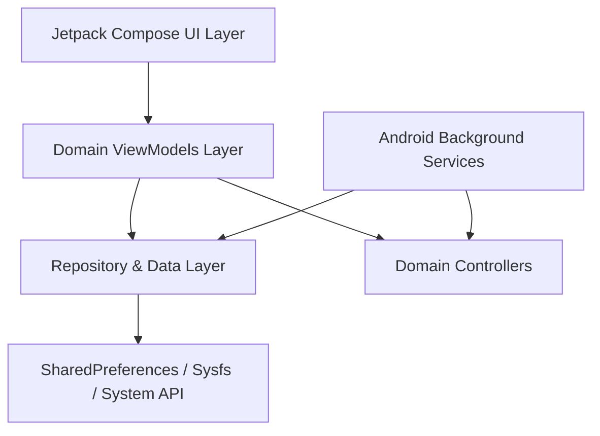

# Architecture & Data Flow Overview

This document details the architectural layout, decoupled ViewModels layer, data flow pipelines, and persistent storage mechanics of the **Essentials** Android application.

---

## Architectural Pattern

The Essentials application follows the **MVVM (Model-View-ViewModel)** pattern combined with a **Feature-Based Modular Architecture**.

---

## Decoupled ViewModels Layer

To prevent monolithic ViewModel anti-patterns, state management is split across domain-specific ViewModels:

| ViewModel | Responsibilities | Primary Data Sources |
| :--- | :--- | :--- |
| **`PermissionViewModel`** | System permission states (`WRITE_SECURE_SETTINGS`, Shizuku binder, accessibility services, overlay permissions). | `PermissionUtils`, `ShizukuUtils` |
| **`SettingsViewModel`** | App preferences, default startup tabs, pinned features, and QS tile order. | `SettingsRepository` |
| **`SecurityViewModel`** | AppLock biometric security, RemoteLock modes, and lock screen security restrictions. | `SettingsRepository`, `BiometricHelper` |
| **`BatteryViewModel`** | Battery statistics, charging state logs, ring cutout overlays, and Maps power saving. | `BatteryInfoUtil`, `SettingsRepository` |
| **`QuickSettingsTilesViewModel`** | QS tile active states and tile customization settings. | `QsTileRegistry`, `SettingsRepository` |
| **`StatusBarIconViewModel`** | Status bar icon blacklist (`icon_blacklist`), Smart Wi-Fi / Data auto-hiding. | `StatusBarIconUtils`, `SettingsRepository` |
| **`AppUpdatesViewModel`** | GitHub repository release tracking, APK downloads, and in-app update prompts. | `GitHubRepository`, `UpdateRepository` |
| **`DIYViewModel`** | Automation triggers, action execution rules, and GenAI prompt generator. | `DIYRepository`, `GenAIAutomationService` |
| **`WatermarkViewModel`** | Photo watermark engine, EXIF metadata parsing, and image processing pipeline. | `WatermarkEngine`, `WatermarkRepository` |

---

## Data Access & Persistence

- **`SettingsRepository`**: Wraps `SharedPreferences` (`essentials_prefs`) using Gson JSON serialization for complex object sets (e.g., pinned feature keys, DNS presets, standby app lists).
- **System Settings Interoperability**: Uses `WRITE_SECURE_SETTINGS` to modify system secure settings (e.g., `doze_always_on`, `refresh_rate_mode`, `icon_blacklist`).
